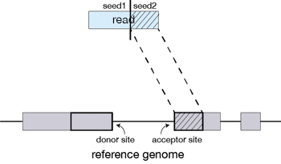
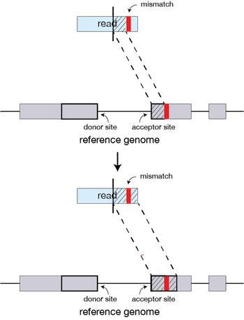
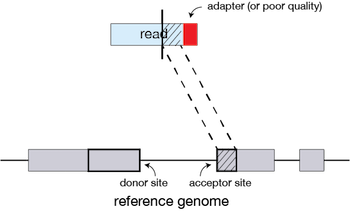
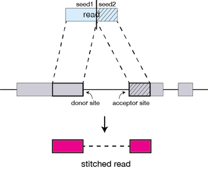
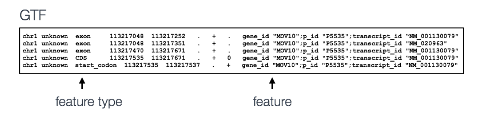

Approximate time: 90 minutes

## Learning Objectives:

* Exploring the genomics files
* Understanding the alignment method STAR utilizes to align sequence reads to the reference genome
* Identifying the intricacies of alignment tools used in NGS analysis (parameters, usage, etc)
* Choosing appropriate STAR alignment parameters for our dataset
* Hands-on alignment

## Read Alignment

The RNAseq workflow begins with quality control and alignment, similar to the other NGS applications. Alignment is followed by read counting within features. Then, library normalization and statistical analysis is performed, followed by data visualization.


## Directory Set-up

To start with RNAseq analysis, we need to set-up our directory structure, and ensure we have all the softwares that we need.

In order to remain organized, I always prepare my directory as follows using `mkdir`:

```
~/Day2/
    ├── raw_data/
    ├── quality_control/
    ├── results/
    ├── STAR_chr2_genome/
    ├── combined_counts/
```

## Part0: executables and tools Setup

The following softwares are installed on the course server for bulk RNAseq:

1. [fastqc](https://www.bioinformatics.babraham.ac.uk/projects/fastqc/)
2. [STAR](https://github.com/alexdobin/STAR)
3. [samtools](https://github.com/samtools/samtools)
4. [IGV](https://software.broadinstitute.org/software/igv/download)
5. [DESeq2](https://bioconductor.org/packages/release/bioc/html/DESeq2.html)

Depending on the software, you can download and compile the source code. Let's install STAR on our server environment using the documentation linked above:

```
$ cd ~/Day2/software_installation
$ git clone https://github.com/alexdobin/STAR.git
$ cd STAR/source
$ make STAR
```

## Part1: Aligning raw RNAseq data using the `STAR` Aligner

### 1.1 QC

> **NOTE:** It is a good practice to perform a short Quality Control step to ensure there are no
serious problems with our samples such as the presence of vector contamination or low quality reads.
In general, bwa mem doesn't need trimming.

```bash
$ cd ~/Day2/raw_data
$ fastqc sample1.fastq
$ firefox sample1_fastqc.html
$ mv *fastqc* ~/Day2/quality_control
```

> **NOTE:** Most of the times, we won't be able to run a Graphical Interface on the server computer. In that case, you could transfer the files to your local computer using *FileZilla* or `scp`.

Now that we have explored the quality of our raw reads, we can move on to read alignment. We perform read alignment or mapping to determine where in the genome the reads originated from. The alignment process consists of choosing an appropriate reference genome to map our reads against and performing the read alignment using one of several splice-aware alignment tools such as [STAR](http://bioinformatics.oxfordjournals.org/content/early/2012/10/25/bioinformatics.bts635) or [HISAT2](http://ccb.jhu.edu/software/hisat2/index.shtml). The choice of aligner is often a personal preference and also dependent on the computational resources that are available to you.

To determine where on the human genome our reads originated from, we will align our reads to the reference genome using [STAR](http://www.ncbi.nlm.nih.gov/pmc/articles/PMC3530905/) (Spliced Transcripts Alignment to a Reference). STAR is an aligner designed to specifically address many of the challenges of RNA-seq data mapping using a strategy to account for spliced alignments.

### 1.2 STAR Alignment Strategy

STAR is shown to have high accuracy and outperforms other aligners by more than a factor of 50 in mapping speed, but it is memory intensive. The algorithm achieves this highly efficient mapping by performing a two-step process:

1. Seed searching
2. Clustering, stitching, and scoring

#### Seed searching

For every read that STAR aligns, STAR will search for the longest sequence that exactly matches one or more locations on the reference genome. These longest matching sequences are called the Maximal Mappable Prefixes (MMPs):


	
The different parts of the read that are mapped separately are called 'seeds'. So the first MMP that is mapped to the genome is called *seed1*.

STAR will then search again for only the unmapped portion of the read to find the next longest sequence that exactly matches the reference genome, or the next MMP, which will be *seed2*. 



This sequential searching of only the unmapped portions of reads underlies the efficiency of the STAR algorithm. STAR uses an uncompressed suffix array (SA) to efficiently search for the MMPs, this allows for quick searching against even the largest reference genomes. Other slower aligners use algorithms that often search for the entire read sequence before splitting reads and performing iterative rounds of mapping.

**If STAR does not find an exact matching sequence** for each part of the read due to mismatches or indels, the previous MMPs will be extended.



**If extension does not give a good alignment**, then the poor quality or adapter sequence (or other contaminating sequence) will be soft clipped.




#### Clustering, stitching, and scoring

The separate seeds are stitched together to create a complete read by first clustering the seeds together based on proximity to a set of 'anchor' seeds, or seeds that are not multi-mapping.

Then the seeds are stitched together based on the best alignment for the read (scoring based on mismatches, indels, gaps, etc.). 



## 1.2 Indexing the genome using STAR

### Set-up

Aligning reads using STAR is a two step process:   

1. Create a genome index 
2. Map reads to the genome

> Given the large size of the human genome, indexing takes a fairly long time (30-60 mins). I have already prepared the indeces for you. On [Biowulf](https://hpc.nih.gov/apps/STAR.html), there are indexes available for a variety of genomes. You could also access indexed genomes from [Illumina's iGenomes](https://support.illumina.com/sequencing/sequencing_software/igenome.html).


```bash
$ ls -l ~/Day2/reference_test/
```

This is a good time to also explore the reference file types we are using for RNAseq:

```bash
$ cd ~/Day2/reference_test/
$ ls -l -h
$ head GRCh38_chr19.gtf
$ head GRCh38_chr19.fa
```
### Fasta file

Let's explore the GRCh38 fasta reference file at `~/Day2/genome/` before alignment.

```bash
$ cd ~/Day2/genome
```
---
**Exercise**
1. How large (Bytes) is this fasta reference? `ls`
2. View the top 20 lines of your fasta reference. `head`
3. Count the number of lines in your fasta reference. `wc`
4. Find all the lines that contain ">". `grep '>'`
5. Find all the lines that contain ">" and in addition to 3 more lines after each hit. `grep -A 3 '>'`
---


### GTF (Gene Transcript Format) file



STAR is memory intensive aligner. For the human genome, it requires more than 40GB of RAM. Thus, we are mapping our reads to the chromosome2 reference which is smaller in size than the complete GRCh38 genome.

### Creating a genome index

Before we generate the index of our chr19 fasta file, let's explore its content.
change your directory to `~/Day2/reference_test`

---

**Exercise**

1. Count the number of lines in `GRCh38_chr19.fa`
2. Confirm that you only have one chromosome in it
3. What is the size of the chromosome2 fasta file? `~/Day2/STAR_chr2_genome`

---

In order to create the genome indexes, you would run the following (per the STAR's manual):

The basic options to **generate genome indices** using STAR are as follows:

* `--runThreadN`: number of threads
* `--runMode`: genomeGenerate mode
* `--genomeDir`: /path/to/store/indexes
* `--genomeFastaFiles`: /path/to/FASTA_file 
* `--sjdbGTFfile`: /path/to/GTF_file
* `--sjdbOverhang`: readlength -1

> *NOTE:* In case of reads of varying length, the ideal value for `--sjdbOverhang` is max(ReadLength)-1. In most cases, the default value of 100 will work similarly to the ideal value.


```bash
cd ~/Day2/reference_test
STAR	--runThreadN 2 \
	--runMode genomeGenerate \
	--genomeDir . \
	--genomeFastaFiles GRCh38_chr19.fa \
	--sjdbGTFfile GRCh38_chr19.gtf \
	--sjdbOverhang 149
```

### Aligning reads

After you have the genome indices generated, you can perform the read alignment. For today, we are using the fasta reference for chromosome2.

### STAR executable and options

Details on STAR and its functionality can be found in the [user manual](https://github.com/alexdobin/STAR/blob/master/doc/STARmanual.pdf); we encourage you to peruse through the manual to get familiar with all available options.

The basic options for aligning reads to the genome using STAR are:

* `--runThreadN`: number of threads / cores
* `--readFilesIn`: /path/to/FASTQ_file
* `--genomeDir`: /path/to/genome_indices_directory
* `--outFileNamePrefix`: prefix for all output files

Listed below are additional parameters that we will use in our command:

* `--outSAMtype`: output filetype (SAM default)
* `--outSAMunmapped`: what to do with unmapped reads
* `--quantMode GeneCounts`: This command will generate the gene counts from the alignment file

> **NOTE:** Default filtering is applied in which the maximum number of multiple alignments allowed for a read is set to 10. If a read exceeds this number there is no alignment output. To change the default you can use `--outFilterMultimapNmax`, but for this lesson we will leave it as default. Also, note that "**STAR’s default parameters are optimized for mammalian genomes.** Other species may require significant modifications of some alignment parameters; in particular, the maximum and minimum intron sizes have to be reduced for organisms with smaller introns" [1](http://bioinformatics.oxfordjournals.org/content/early/2012/10/25/bioinformatics.bts635.full.pdf+html).

We can access the software by simply using the STAR command followed by the basic parameters described above and any additional parameters. The full command is provided below for you to copy paste into your terminal. If you want to manually enter the command, it is advisable to first type out the full command in a text editor (i.e. [gedit](https://wiki.gnome.org/Apps/Gedit) or [Notepad++](https://notepad-plus-plus.org/)) and then copy paste into the terminal. This will make it easier to catch typos and make appropriate changes. 


```bash
cd ~/Day2

STAR	--runThreadN 2 \
	--genomeDir STAR_chr2_genome/ \
	--readFilesIn raw_data/sample1.fastq \
	--quantMode GeneCounts \
	--outFileNamePrefix results/sample1_
```

The output is stored in the `~/Day2/results` folder.

```bash
$ cd ~/Day2/results
```


**Questions**

1. Is the output of our aligner sorted?
2. What are the columns in a sam file?


### 1.3 Convert your sam file to bam

SAM (Sequence Alignment Map) files are pure text files which take too much space. Common practice
is to compress these files using `samtools` into BAM (Binary Alignment Map) files.

```bash
$ samtools view -b sample1_Aligned.out.sam > sample1.bam
```

### 1.4 Sorting your alignment bam file

The next step is to sort all the aligned records by their chromosomal location.
There are a variety of tools for this task and they all perform the same task. Some are faster than
others. We will use `samtools` which is very fast and generates all the needed downstream files.

```bash
$ samtools sort sample1.bam > sample1.sorted.bam
```

This will generate the sorted bam file in the same directory.

---
**Exercise**

We currently have 3 alignment files. `sample1.sam`, `sample1.bam`, and `sample1.sorted.bam`

1. How much smaller is that BAM file compared with the SAM?
2. How does the size of the sorted BAM file compare with our unsorted BAM file?
---

### 1.5 Creating an index for the final bam file

Now that we have a sorted BAM file that has duplicates marked, we need to ensure the index file
for it exist. Just like a book that needs a table of contents, a bam file needs an index.

```bash
$ samtools index sample1.sorted.bam
```

This file is now ready for visualization in IGV or any other visualization tool.

[IGV](http://software.broadinstitute.org/software/igv/) (Integrative Genomics Viewer) is a graphical
tool for the visualiztion of sorted bam files.

> **NOTE** BAM files must be indexed before viewing in IGV. Ensure a bam index file exists in the same directory alongside your BAM file.


---
*This lesson has been developed by Shahin Shahsavari adapted from [Harvard Chan Bioinformatics Core (HBC)](http://bioinformatics.sph.harvard.edu/). These are open access materials distributed under the terms of the [Creative Commons Attribution license](https://creativecommons.org/licenses/by/4.0/) (CC BY 4.0), which permits unrestricted use, distribution, and reproduction in any medium, provided the original author and source are credited.*
